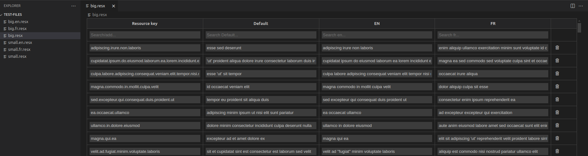

# RESX Lord

**Blazing fast RESX manager** - A powerful VS Code extension that allow developers manage .NET resource files in an integrated grid view. With its grid-based editor, you can effortlessly view and edit multiple language variants side-by-side, making localization work faster and more efficient than ever.

## Features

RESX Lord revolutionizes how you work with .NET resource files by providing:

### 🚀 **Super Performant Loading**
- Lightning-fast parsing and rendering of resource files
- Efficiently handles large resource files with thousands of entries
- Optimized Vue.js-based webview interface

### 🌐 **Multi-Language Overview**
- Automatically discovers and loads all resource files with the same base name
- Side-by-side view of all language variants (e.g., `app.resx`, `app.en.resx`, `app.fr.resx`)
- Unified grid interface showing all translations in one place

### ✏️ **Intuitive Editing**
- Edit resource keys and values directly in a spreadsheet-like grid
- Add new resource keys across all languages simultaneously
- Real-time search and filtering capabilities

### 🔍 **Smart Search & Filter**
- Search across resource keys and values
- Filter by specific languages or content
- Instant results as you type

### 💾 **Seamless Integration**
- Works as a custom editor for `.resx` files
- Preserves original file formatting and structure
- Auto-saves changes back to individual resource files

## Getting Started

1. Install the RESX Lord extension
2. Open any `.resx` file in your workspace
3. The custom grid editor will automatically open, showing all related language files
4. Start editing your resources with the intuitive interface!

## Performance

RESX Lord is built for performance:
- **Fast XML parsing** using optimized libraries
- **Efficient rendering** with Vue.js virtual DOM
- **Minimal memory footprint** even with large resource files
- **Instant search** with debounced filtering

## Release Notes

### 0.0.1

Initial release of RESX Lord featuring:
- Custom RESX file editor with grid interface
- Multi-language resource file discovery and loading
- High-performance parsing and rendering
- Real-time editing and search capabilities

---

## Contributing

We welcome contributions! Please feel free to submit issues and pull requests.

## License

This project is licensed under the MIT License - see the [LICENSE](./LICENSE) file for details.

---

**Enjoy blazing fast RESX management with RESX Lord!** ⚡
